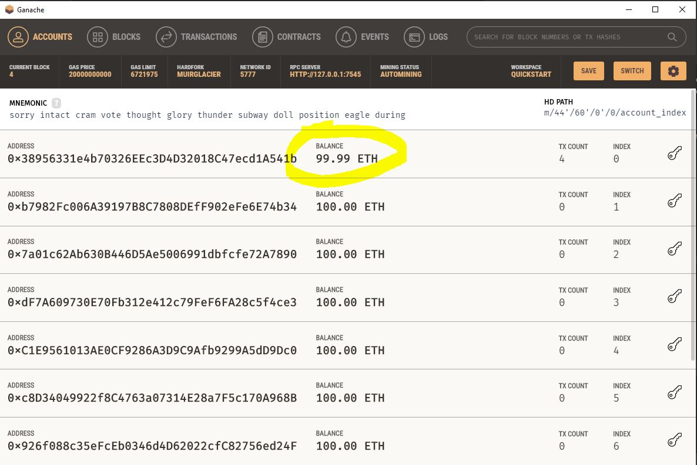

# Todo List app in blockchain ethereum

### Prerequisites
(1) Install truffle suite
```
cd C:\Users\admin\Documents\Projects\softup\eth-todo-list
npm install --g --production windows-build-tools  (as admin)
npm install -g truffle@5.0.2
```

(2) Download Truffle Suite Ganache https://trufflesuite.com/ganache/ <br/>

(3) Add Metamask plugin in chrome


##### Compile & Migrate smart contract
```
npm install
truffle compile
truffle migrate
```

##### Console
```
⚠️  Important ⚠️
If you're using an HDWalletProvider, it must be Web3 1.0 enabled or your migration will hang.


Starting migrations...
======================
> Network name:    'development'
> Network id:      5777
> Block gas limit: 6721975


1_initial_migration.js
======================

   Deploying 'Migrations'
   ----------------------
   > transaction hash:    0x3f278ec951d10461cd25edfbd3433796701ce9e926a48b984975afcc326959a1
   > Blocks: 0            Seconds: 0
   > contract address:    0xf6e1a5FF80D4addF64a61CCF6BE79a1449BCa20D
   > account:             0x38956331e4b70326EEc3D4D32018C47ecd1A541b
   > balance:             99.9899739
   > gas used:            206601
   > gas price:           20 gwei
   > value sent:          0 ETH
   > total cost:          0.00413202 ETH

   > Saving artifacts
   -------------------------------------
   > Total cost:          0.00413202 ETH


2_deploy_contracts.js
=====================

   Replacing 'TodoList'
   --------------------
   > transaction hash:    0x4e3f656a85c9cb8a298c82b790366f4ed63456bbd23dc5690b591dd591788f94
   > Blocks: 0            Seconds: 0
   > contract address:    0x86F272638ba892693FF27517738b0248a93c489a
   > account:             0x38956331e4b70326EEc3D4D32018C47ecd1A541b
   > balance:             99.98821184
   > gas used:            88103
   > gas price:           20 gwei
   > value sent:          0 ETH
   > total cost:          0.00176206 ETH

   > Saving artifacts
   -------------------------------------
   > Total cost:          0.00176206 ETH


Summary
=======
> Total deployments:   2
> Final cost:          0.00589408 ETH
```

##### Ganache in Local
Publishing of a contract requires gas thats why 0.01 ETH less.



### Links
[Ganache - Personal Ethereum blockchain used to run tests, execute commands in local](https://trufflesuite.com/ganache/)````